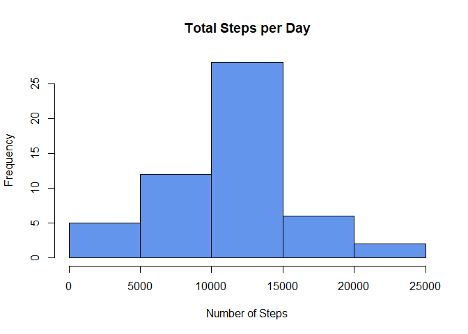
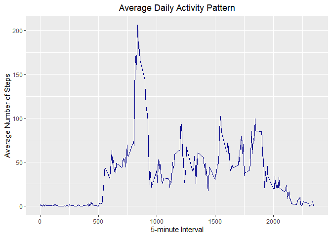
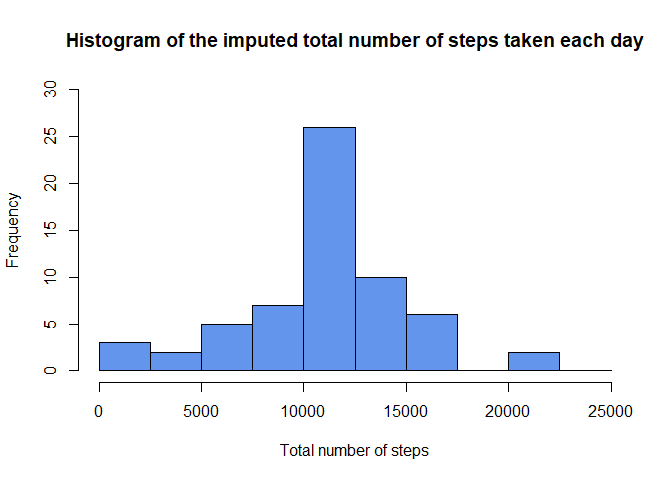
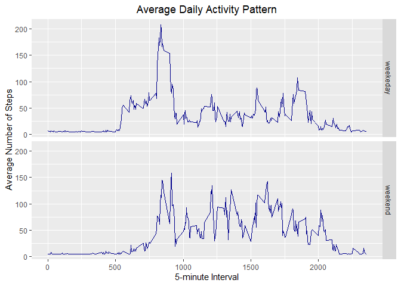

## Loading and preprocessing the data

```r
# unzipping the data
if (!file.exists('activity.csv')) {
      unzip(zipfile = "activity.zip")
}

# reading the data
activityData <- read.csv(file="activity.csv", header=TRUE)
```


## What is mean total number of steps taken per day?

```r
# Calculate the total steps taken per day
totSteps <- aggregate(steps ~ date, activityData, FUN=sum)

# Make a histogram of the total number of steps taken per day
hist(totSteps$steps,
     main = "Total Steps per Day",
     xlab = "Number of Steps",
     col='cornflowerblue')
```

<!-- -->

```r
# Calculate and report the mean steps taken per day
meanSteps <- mean(totSteps$steps, na.rm = TRUE)

# Calculate and report the median steps taken per day
medianSteps <- median(totSteps$steps, na.rm = TRUE)


print(paste("Mean steps per day:",meanSteps))
```

```
## [1] "Mean steps per day: 10766.1886792453"
```

```r
print(paste("Median steps per day:",medianSteps))
```

```
## [1] "Median steps per day: 10765"
```


## What is the average daily activity pattern?

```r
# Make a time-series plot of the 5-minute interval and the average number of
# steps taken, averaged acoss all days.

library(ggplot2) # loading the packages

# creating the plot
meanStepsByInt <- aggregate(steps ~ interval, activityData, mean)
ggplot(data = meanStepsByInt, aes(x = interval, y = steps)) +
  geom_line(color="blue4") +
  ggtitle("Average Daily Activity Pattern") +
  xlab("5-minute Interval") +
  ylab("Average Number of Steps") +
  theme(plot.title = element_text(hjust = 0.5))
```

<!-- -->

```r
# Which 5-minute interval across all days contain the maximum number of steps
maxInterv <- meanStepsByInt[which.max(meanStepsByInt$steps),]
maxInterv
```

```
##     interval    steps
## 104      835 206.1698
```

## Imputing missing values

1. Calculate and report the total number of missing values in the dataset

```r
# counting the number of missing values
missingVals <- sum(is.na(activityData$steps))
print(paste('No.of missing values=',missingVals))
```

```
## [1] "No.of missing values= 2304"
```

2. Forming a strategy

```r
# Find the NA positions
naPos <- which(is.na(activityData$steps))

# Create a vector of means
meanVector <- rep(mean(activityData$steps, na.rm=TRUE), times=length(naPos))
```

3. Creating a new data-set by filling missing values

```r
# Replace the NAs by the means
activityData[naPos, "steps"] <- meanVector

# view the new dataset
head(activityData)
```

```
##     steps       date interval
## 1 37.3826 2012-10-01        0
## 2 37.3826 2012-10-01        5
## 3 37.3826 2012-10-01       10
## 4 37.3826 2012-10-01       15
## 5 37.3826 2012-10-01       20
## 6 37.3826 2012-10-01       25
```

4.Make a histogram of the total number of steps taken each day and calculate and report the **mean** and **median** total number of steps taken per day.

```r
# Compute the total number of steps each day (NA values removed)
totData <- aggregate(activityData$steps, by=list(activityData$date), FUN=sum)

# Rename the attributes
names(totData) <- c("date", "total")

# Compute the histogram of the Imputed total number of steps each day
hist(totData$total, 
     breaks=seq(from=0, to=25000, by=2500),
     col="cornflowerblue", 
     xlab="Total number of steps", 
     ylim=c(0, 30), 
     main="Histogram of the imputed total number of steps taken each day")
```

<!-- -->

```r
newMean<-mean(totData$total)
newMedian<-median(totData$total)
print(paste("Mean steps per day:",newMean))
```

```
## [1] "Mean steps per day: 10766.1886792453"
```

```r
print(paste("Median steps per day:",newMedian))
```

```
## [1] "Median steps per day: 10766.1886792453"
```
Due to the imputation **mean** estimates did not changed, but **median** estimates did changed.

## Are there differences in activity patterns between weekdays and weekends?

```r
# Create a new factor variable in the dataset with two levels - "weekend" and "weekday"
DayType <- function(date) {
  day <- weekdays(date)
  if (day %in% c('Monday', 'Tuesday', 'Wednesday', 'Thursday', 'Friday'))
      return ("weekeday")
  else if (day %in% c('Saturday', 'Sunday'))
      return ("weekend")
  else
      stop ("Invalid Date Format.")
}

# Adding the two factors to the dataset
activityData$date <- as.Date(activityData$date)
activityData$day <- sapply(activityData$date, FUN = DayType)

# Make a panel plot containnig a time-series plot of the 5-minute interval
# and the average number of steps taken across all weekdays or weekends
meanStepsByDay <- aggregate(steps ~ interval + day, activityData, mean)
ggplot(data = meanStepsByDay, aes(x = interval, y = steps)) + 
  geom_line(color="blue4") +
  facet_grid(day ~ .) +
  ggtitle("Average Daily Activity Pattern") +
  xlab("5-minute Interval") +
  ylab("Average Number of Steps") +
  theme(plot.title = element_text(hjust = 0.5))
```

<!-- -->
